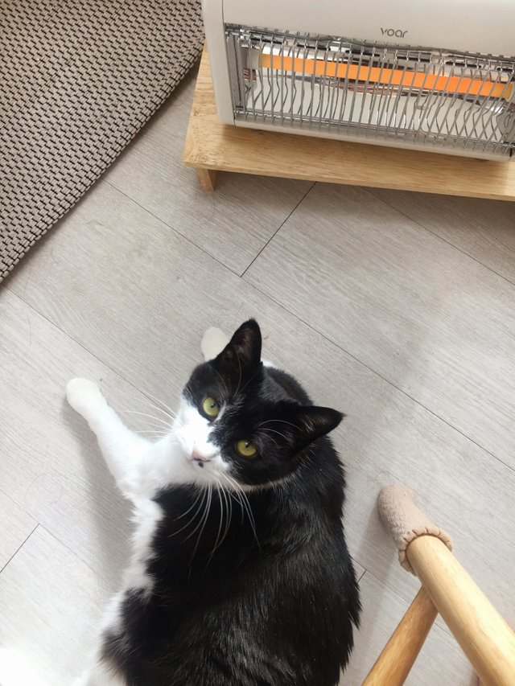

# 내일의 집

### 1. GNB

- 로그인을 하지 않은 경우

```html
<div class="button-group">
  <a href="/" class="gnb-icon-button" aria-label="장바구니 페이지로 이동">
    <i class="ic-cart"></i>
    <strong class="badge">12</strong>
  </a>

  <div class="gnb-auth sm-hidden">
    <a href="/" class="login">로그인</a>
    <a href="/">로그아웃</a>
  </div>
</div>
```

- 로그인을 했을 경우

```html
<div class="button-group">
  <a
    href="/"
    class="sm-hidden gnb-icon-button"
    aria-label="스크랩북 페이지로 이동"
  >
    <i class="ic-bookmark"></i>
  </a>

  <a
    href="/"
    class="sm-hidden gnb-icon-button"
    aria-label="내 소식 페이지로 이동"
  >
    <i class="ic-bell"></i>
  </a>

  <a href="/" class="gnb-icon-button" aria-label="장바구니 페이지로 이동">
    <i class="ic-cart"></i>
    <strong class="badge">12</strong>
  </a>

  <button
    type="button"
    class="lg-hidden gnb-icon-button is-search"
    aria-label="검색창 열기 버튼"
  >
    <i class="ic-search"></i>
  </button>
  <button
    type="button"
    class="gnb-avatar-button sm-hidden"
    aria-label="마이 메뉴 열기 버튼"
  >
    <div class="avatar-32">
      
    </div>
  </button>
</div>
```

### 2. Sidebar

- 로그인을 하지 않은 경우

```html
<div class="sidebar-auth">
  <a href="/" class="btn-outlined btn-40">로그인</a>
  <a href="/" class="btn-primary btn-40">회원가입</a>
</div>
```

- 로그인을 했을 경우

```html
<div class="sidebar-user">
  <a href="/">
    <div class="avatar-24">
      
    </div>
    <strong class="username"
      >사딸라딸라딸라라딸라라딸라라딸라라딸라라딸라</strong
    >
  </a>
</div>
```

### 3. Review

- 리뷰가 0개인 경우

```html
<section
  class="product-section product-review"
  id="product-review"
  role="tabpanel"
>
  <header class="product-section-header">
    <h1 class="title">리뷰</h1>
    <strong class="badge" aria-label="0개">0</strong>
    <a class="text-button" href="/">리뷰 쓰기</a>
  </header>

  <div class="product-section-content">
    <p class="review-empty">
      첫 리뷰를 남겨주세요! <br />
      최대 <strong>500P</strong>를 드립니다.
    </p>
  </div>
</section>
```

- 리뷰가 1개 이상인 경우

```html
<section
  class="product-section product-review"
  id="product-review"
  role="tabpanel"
>
  <header class="product-section-header">
    <h1 class="title">리뷰</h1>
    <strong class="badge" aria-label="566개">566</strong>
    <a class="text-button" href="/">리뷰 쓰기</a>
  </header>

  <div class="product-section-content">
    <div class="review-scoreboard">
      <div class="score-summary">
        <strong class="average-score" aria-label="평점 4.8"> 4.8 </strong>
        <div class="star-rating" aria-hidden>
          <i class="ic-star is-active"></i>
          <i class="ic-star is-active"></i>
          <i class="ic-star is-active"></i>
          <i class="ic-star is-active"></i>
          <i class="ic-star is-active"></i>
        </div>
      </div>

      <div class="score-detail">
        <dl class="score-stats-list">
          <div class="score-stats-item is-active">
            <dt>5점</dt>
            <dd>
              <div class="bar-graph" aria-hidden>
                <div class="active-bar"></div>
              </div>
              <strong class="count" aria-label="467명">467</strong>
            </dd>
          </div>
          <div class="score-stats-item">
            <dt>4점</dt>
            <dd>
              <div class="bar-graph" aria-hidden>
                <div class="active-bar"></div>
              </div>
              <strong class="count" aria-label="87명">87</strong>
            </dd>
          </div>
          <div class="score-stats-item">
            <dt>3점</dt>
            <dd>
              <div class="bar-graph" aria-hidden>
                <div class="active-bar"></div>
              </div>
              <strong class="count" aria-label="13명">13</strong>
            </dd>
          </div>
          <div class="score-stats-item">
            <dt>2점</dt>
            <dd>
              <div class="bar-graph" aria-hidden>
                <div class="active-bar"></div>
              </div>
              <strong class="count" aria-label="0명">0</strong>
            </dd>
          </div>
          <div class="score-stats-item">
            <dt>1점</dt>
            <dd>
              <div class="bar-graph" aria-hidden>
                <div class="active-bar"></div>
              </div>
              <strong class="count" aria-label="0명">0</strong>
            </dd>
          </div>
        </dl>
      </div>
    </div>

    <ol class="review-list">
      <li class="review-item">
        <article class="review-card">
          <!-- 완결성이 있는 하나의 부분일 때 article 사용가능, 물론 section도 사용가능 -->
          <header class="review-card-header">
            <h3 class="visually-hidden">문제아 님이 작성한 리뷰</h3>

            <a class="avatar-24" href="/">
              
            </a>

            <div class="info">
              <a class="username" href="/"><strong>문제아</strong></a>

              <div class="detail">
                <div class="star-rating-13" aria-label="평점 5점 중 5점">
                  <i class="ic-star is-active"></i>
                  <i class="ic-star is-active"></i>
                  <i class="ic-star is-active"></i>
                  <i class="ic-star is-active"></i>
                  <i class="ic-star is-active"></i>
                </div>
                <div class="misc">
                  <time datetime="2023-01-01">2023-01-01</time>
                  <span>오늘의 집 구매</span>
                </div>
              </div>
            </div>
          </header>

          <div class="review-card-body">
            <p>
              집 전체를 데운다기보다는 틀어놓고 앞에 앉아있으면 따땃해지는
              정도예요. 불 꺼놓고 난로 켜고 담요 덮은 채로 커피 마시면 아주
              좋아요. 고양이도 좋아해요.
            </p>
          </div>

          <footer class="review-card-footer">
            <button class="btn-outlined btn-32" type="button">
              도움이 돼요
            </button>
            <p><strong>7</strong>명에게 도움이 되었습니다.</p>
          </footer>
        </article>
      </li>

      <!-- NOTE: 유저 이미지가 없는 경우 & 사용자가 도움됨을 체크, 도움됨 1+ -->
      <li class="review-item">
        <article class="review-card">
          <header class="review-card-header">
            <h3 class="visually-hidden">우유파이 님이 작성한 리뷰</h3>

            <a
              class="avatar-24"
              href="/"
              aria-label="우유파이님의 프로필로 이동"
            >
            </a>

            <div class="info">
              <a class="username" href="/"><strong>우유파이</strong></a>

              <div class="detail">
                <div class="star-rating-13" aria-label="평점 5점 중 5점">
                  <i class="ic-star is-active"></i>
                  <i class="ic-star is-active"></i>
                  <i class="ic-star is-active"></i>
                  <i class="ic-star is-active"></i>
                  <i class="ic-star"></i>
                </div>
                <div class="misc">
                  <time datetime="2023-01-01">2023-01-01</time>
                  <span>오늘의 집 구매</span>
                </div>
              </div>
            </div>
          </header>

          <div class="review-card-body">
            <p>
              작업실에서 손이 시려워서 책상 위에 올려서 쓸걸로 골랐습니다!
              아주아주 뜨듯하고 크기도 적당하고 민트 사고싶엇지만 품절 ㅠㅠ
            </p>
          </div>

          <footer class="review-card-footer">
            <button class="btn-primary btn-32" type="button">
              <i class="ic-check" aria-hidden></i> 도움됨
            </button>
            <p><strong>8</strong>명에게 도움이 되었습니다.</p>
          </footer>
        </article>
      </li>

      <!-- NOTE: 유저가 리뷰 이미지를 올린 경우 & 사용자가 도움됨을 미체크, 도움됨 X-->
      <li class="review-item">
        <article class="review-card">
          <header class="review-card-header">
            <h3 class="visually-hidden">
              고영희님이좋아합니다 님이 작성한 리뷰
            </h3>

            <a
              class="avatar-24"
              href="/"
              aria-label="고영희님이좋아합니다님의 프로필로 이동"
            >
            </a>

            <div class="info">
              <a class="username" href="/"
                ><strong>고영희님이좋아합니다</strong></a
              >

              <div class="detail">
                <div class="star-rating-13" aria-label="평점 5점 중 5점">
                  <i class="ic-star is-active"></i>
                  <i class="ic-star is-active"></i>
                  <i class="ic-star is-active"></i>
                  <i class="ic-star is-active"></i>
                  <i class="ic-star"></i>
                </div>
                <div class="misc">
                  <time datetime="2023-01-01">2023-01-01</time>
                  <span>오늘의 집 구매</span>
                </div>
              </div>
            </div>
          </header>

          <div class="review-card-body">
            <button class="review-image" type="button">
              
            </button>

            <p>
              고양이가 좋아해요 ㅎㅎ 섬세한 온도조절이 안되는게 아쉽지만, 이
              가격 이 디자인이면 만족할 수 밖에 없어요 :) 좋습니다!
            </p>
          </div>

          <footer class="review-card-footer">
            <button class="btn-outlined btn-32" type="button">
              도움이 돼요
            </button>
          </footer>
        </article>
      </li>
    </ol>

    <div class="pagination">
      <!-- 1페이지인 경우 이전 페이지는 없으므로 -->
      <!-- <button class="page-control page-prev">
                    <i class="ic-chevron"></i>
                  </button> -->
      <ol class="page-list">
        <li class="page-item page-active"><a href="/">1</a></li>
        <li class="page-item"><a href="/">2</a></li>
        <li class="page-item"><a href="/">3</a></li>
        <li class="page-item"><a href="/">4</a></li>
        <li class="page-item"><a href="/">5</a></li>
      </ol>
      <button class="page-control page-next">
        <i class="ic-chevron"></i>
      </button>
    </div>
  </div>
</section>
```
